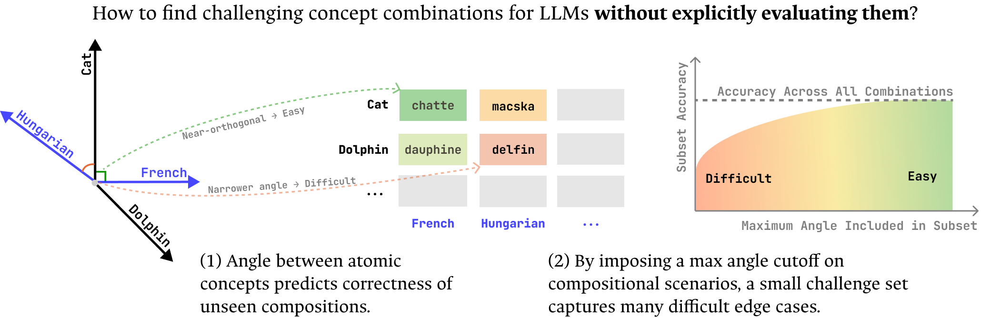

# Adversarial Concept Search (ACS)

Code for **"Adversarial Concept Search: Predicting Compositional Errors From Feature
Geometry"**.

We predict *where* an LLM will fail on compositional tasks — multihop reasoning,
multilingual factual recall — using only the geometry of its internal representations,
without evaluating the composed input itself. The core quantity is **Compositional
Interference (CI)**: how non-orthogonal (close in angle) the atomic concept
representations `a_i` that make up a composition are. Near-orthogonal concepts compose
reliably; concepts encoded close together interfere, and interference predicts failure.



Each task below is two stages: **stage 1** (GPU) runs the model and caches residuals;
**stage 2** (CPU-only, reads stage 1's output) computes CI and correlates it against
composed-query accuracy.

`pip install -r requirements.txt` sets up the environment (Python 3.10) for every pipeline
below, SCAN included.

`helpers.py`, `multihop_auto_cluster.py`, and `multilingual_experiment_auc_plots.py` are
shared helpers, imported by the scripts below rather than run directly.

---

## I. SCAN (synthetic proof-of-concept)

Section 3 of the paper: toy Transformers trained from scratch on SCAN (varying coverage
and model size), showing the angle between atomic-concept representations (`walk`, `left`,
`twice`, ...) predicts held-out compositional accuracy.

> Adapted from [`ryeii/Representational-Homomorphism-for-Transformer-Language-Models`](https://github.com/ryeii/Representational-Homomorphism-for-Transformer-Language-Models)
> (`he_probe/`) — only the files this pipeline uses are copied in, no checkpoints/results/
> figures from the source repo; each file has a one-line header pointing back to its source path.

- `SCAN/SCAN/simple_split/` — the official SCAN benchmark data (BSD-licensed, Lake & Baroni)
  that `gen_data_scan.py` reads train/test examples from; needed for stage 1 to run at all
- `SCAN/he_probe/experiment_scan.py` — stage 1: train
- `SCAN/he_probe/analysis_atomic_avg.py` — stage 2: compute CI, evaluate vs. OOD accuracy
- `SCAN/make_summary_plots.py` — aggregates stage-2 outputs across checkpoints
- `SCAN/scan_ci_demo.ipynb` — single-checkpoint demo: CI heatmap, atomic-concept PCA,
  cumulative/noncumulative/error-recall curves, and the 10 hardest (highest-CI) examples —
  self-contained, no GPU, runs in seconds (data in `SCAN/demo_data/`)

```bash
cd ACS/SCAN
python he_probe/experiment_scan.py --config he_probe/experiment_scan_configs/config_d32_sweep_seeds_fixed_seed_data2.json
python -m he_probe.analysis_atomic_avg --checkpoint <ckpt.pt> --results_dir <dir> \
    --seed <s> --d_model <d> --n_heads <h> --d_ff <f> --n_layers <l> \
    --data_mode size_variation --size_variation_p <p> --aggregation cumulative_coherence \
    --select_best_layer cumulative --results_subdir analysis_results
python make_summary_plots.py --results_dir <dir> --plot_folder_name <name>
```

**Notes**
- Stage 1 trains one checkpoint per (seed × architecture × coverage) in the config, saved
  under `results_dir`.
- Stage 2's `--seed`/`--d_model`/`--n_heads`/`--d_ff`/`--n_layers`/`--size_variation_p` must
  match the checkpoint (encoded in its filename); to sweep every checkpoint, loop over
  `find results_dir -name "*.pt"`.
- `make_summary_plots.py` only looks inside a subdirectory literally named `analysis_results`
  under each `size_p*/` — stage 2's own default (`analysis_results_atomic_avg_train`) won't be
  found, so pass `--results_subdir analysis_results` to stage 2 if you plan to run this after.

All three stages were smoke-tested end to end (tiny data, few epochs) — confirmed working.

---

## II. Multihop Reasoning

Section 4.1 of the paper: a composed query `g(f(x))` chains an atomic first-hop query `f`
(e.g. `author of 1984`) into an atomic second-hop query `g`
(`birthyear of [the author of 1984]`). We extract last-token residuals for the atomic
first- and second-hop queries, cluster-center them into concept representations `a_f` and
`a_g`, and use CI between them to predict whether the model composes them correctly.

- `multihop_datasets_save_resid_stream_logits.py` — stage 1
- `multihop_experiments_auto_cluster_center.py` — stage 2

**Pipeline:**
```bash
cd ACS
python multihop_datasets_save_resid_stream_logits.py --model_name llama-3b
python multihop_experiments_auto_cluster_center.py --model_name llama-3b --experiments_dir multihop_experiments
```

**Notes**
- `multihop_datasets_save_resid_stream_logits.py` pulls the `apoorvkh/composing-functions`
  HF dataset automatically — no local data needed. For every query it saves the last-token
  residual stream (all layers) for all three prompt types: `Qx_Fx` (first hop), `QFx_GFx`
  (second hop given the gold first-hop answer), and `Qx_GFx` (the full composed query).
  Output directory is fixed — `multihop_functions_resid_logits_{model_name}` (hyphens →
  underscores) — which stage 2 looks for automatically, so just keep `--model_name`
  consistent between the two commands.
- `multihop_experiments_auto_cluster_center.py` builds `a_f`/`a_g` from the stage-1 residuals,
  auto-clusters tasks by composition family, and computes CI to predict composed-query
  accuracy (the multihop curve in Figure 4a). Loads a tokenizer only — no model weights, no
  GPU. Writes auto-cluster plots (`.svg`/`.html`) and tables (`.json`) under
  `--experiments_dir` (default `multihop_experiments/`).

---

## III. Multilingual Fact Recall

Section 4.1 of the paper: for a factual query in target language `ℓ`, the active concept
set is a factual concept `q` (its English form) and a language concept `ℓ`. We estimate the
fact representation `a_q` from the English query and the language subspace `B_ℓ` via SVD
over residuals from OSCAR text in that language, then compute CI between `a_q` and `B_ℓ` to
predict cross-lingual transfer failure — without needing the translated input.

- `KLAR_datasets_save_resid_streams_logits.py` — stage 1a (KLAR factual queries)
- `dynamic_tyler_geometry.py` — stage 1b (OSCAR per-language background residuals)
- `multilingual_experiment_merged_lans.py` — stage 2

**Pipeline:**
```bash
cd ACS
python KLAR_datasets_save_resid_streams_logits.py --model_name llama-3b --n_shots 0 --prompt_template_which 0
python dynamic_tyler_geometry.py --model_name llama-3b
python multilingual_experiment_merged_lans.py --model llama-3b
```

**Notes**
- `KLAR_datasets_save_resid_streams_logits.py` reads `klar/klar/<lang>/<relation>.json`
  (run with CWD = `ACS/` so the glob resolves) and saves last-token residuals + predictions
  per query. Output directory is fixed —
  `klar/{model_name}_eval_save_all_layers_prompt{prompt_template_which}` — matching what
  stage 2 expects automatically.
- `dynamic_tyler_geometry.py` streams the (gated) `oscar-corpus/OSCAR-2109` dataset live —
  nothing local to copy in. This is the raw material stage 2 reduces to the per-language
  SVD subspace `B_ℓ`. `--model_name` selects the model. Saves to `oscar_geometry_{model_name}/...`; large, safe to
  delete once stage 2 has built `oscar_subspaces_cache_{model_name}/` from it.
- `multilingual_experiment_merged_lans.py` needs stage 1a's KLAR output and either
  stage 1b's raw OSCAR residuals or an already-populated `oscar_subspaces_cache_{model_name}/`
  (the SVD cache is built on first run, so you only need the raw OSCAR data once). It
  computes CI(`a_q`, `B_ℓ`) per language and evaluates it against fact-recall accuracy
  (Figures 4b–c, 5 in the paper). Writes under `multilingual_experiments_{model_name}/`.
